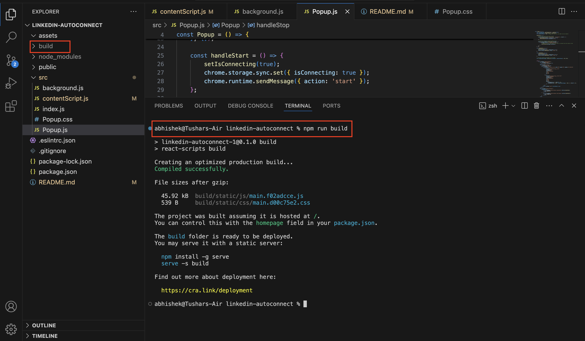
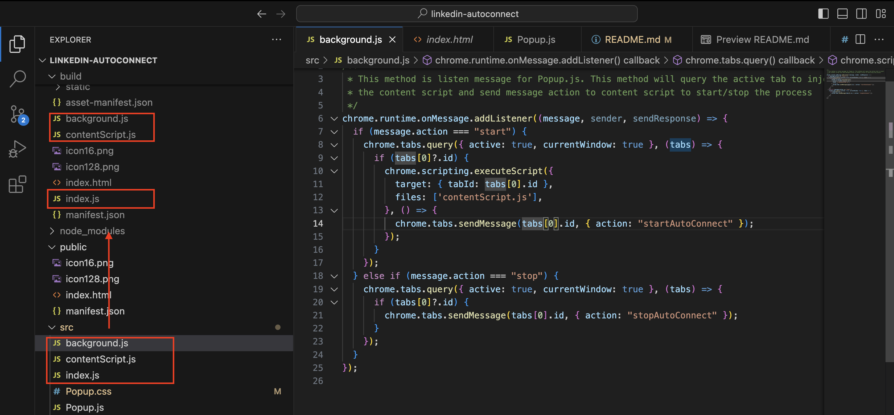
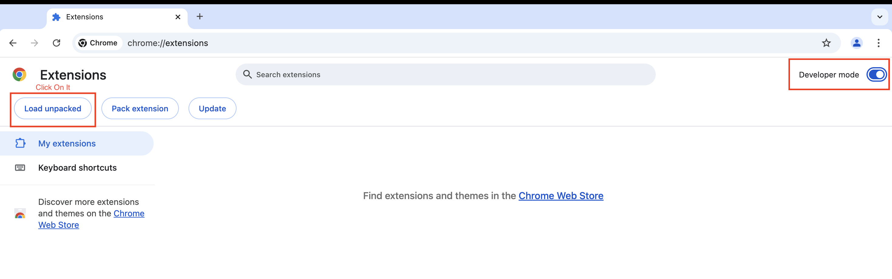
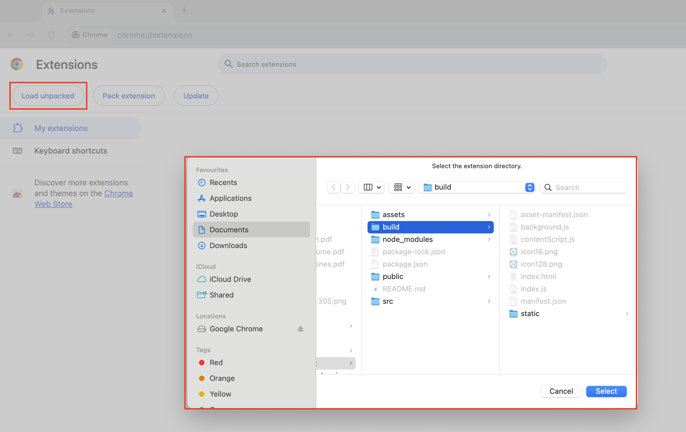
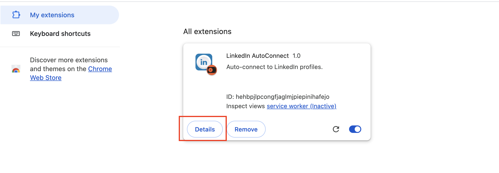
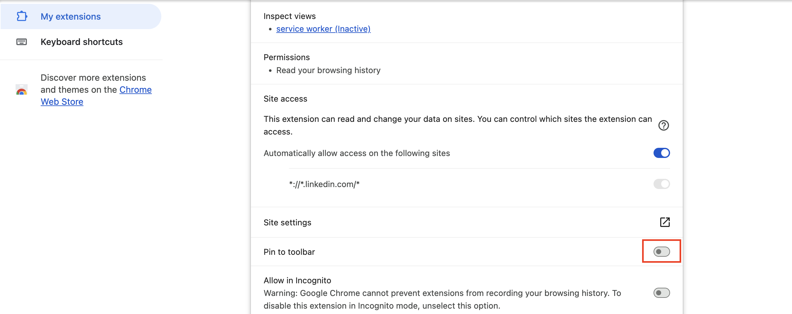
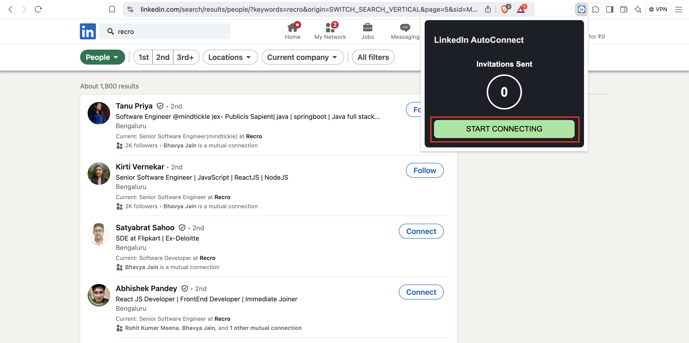

# Auto Connection Request Sender

## Overview
This project automates the process of sending connection requests on LinkedIn. It identifies "Connect" buttons on the page, waits for a random delay between 5 to 10 seconds, and then clicks the button to send the connection request without a note. It also keeps track of the number of invites sent using Chrome storage.

## Table of Contents
- [Installation](#installation)
- [Usage](#usage)
- [Architecture](#architecture)

## Installation

### Prerequisites
- Google Chrome or any Chromium-based browser
- Basic knowledge of Chrome extensions

### Steps
1. **Clone the Repository:**
   ```bash
   git clone https://github.com/abhishekgoyalp/LinkedIn-AutoConnect.git
   cd LinkedIn-AutoConnect
   npm i # For installing the node modules that will help in building the project
   ```
2. **Make Build of this Project**
    - Open the terminal and run `npm run build` command.
   - It will create a build folder which is the installable extension folder.
      
    - Copy the `src/index.js` `src/background.js` and `src/contentScript.js` files and paste under the build directory.
      
    - Now, it is ready to deploy.

3. **Load the Extension:**
   - Open Chrome and go to `chrome://extensions/`.
   - Enable "Developer mode" at the top right.
      
   - Click "Load unpacked" and select the build directory where extension files are located.
      
   - LinkedIn AutoConnect extension is added in My extension list. Click on the detail button and enable the pin to toolbar option.
      
      

## Usage
Once the extension is pin to toolbar, open the linkedin and search for connections then click on the LinkedIn AutoConnect icon and click on **START CONNECTING** to begin the connecting

It will click on the Connect button. Before clicking it will wait for a random time between 5 and 10 seconds.
Use **STOP CONNECTING** button for stop this process.

## Architecture

The architecture of this project is designed around a Chrome extension model, which allows it to interact directly with the webpage DOM. Here’s a breakdown of the major components:

1. **Content Script:**
   - The core functionality resides in the content script, which listens for messages from the background script to start or stop the auto-connect process.
   - It uses the `querySelectorAll` method to find all buttons on the page, filtering for those labeled "Connect".
   - The script incorporates randomized delays to prevent the appearance of automated behavior, ensuring that connection requests feel more organic.

2. **Chrome Storage API:**
   - The project utilizes the Chrome Storage API to persist the invite count across page reloads and sessions. This is essential for tracking the number of connection requests sent without loss of data.
   - The invite count is initialized from storage upon loading the script and reset to zero upon page refresh.

3. **Message Passing:**
   - The project employs Chrome's messaging system to facilitate communication between the content script and the background script, allowing for dynamic control of the auto-connection process.

### Code Discussion
The code is structured to separate concerns, making it easy to maintain and extend. Key functionalities like initiating connections, managing delays, and updating invite counts are modularized. 

- The choice to implement a randomized delay helps to avoid detection by the platform as a bot, simulating more human-like behavior. 
- The design emphasizes reusability and clarity, with well-defined functions for each core task, enhancing the overall readability of the code.
