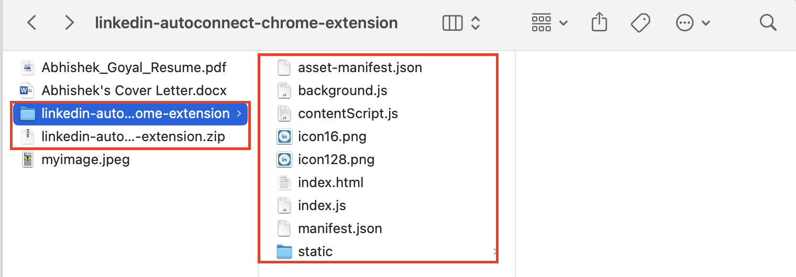
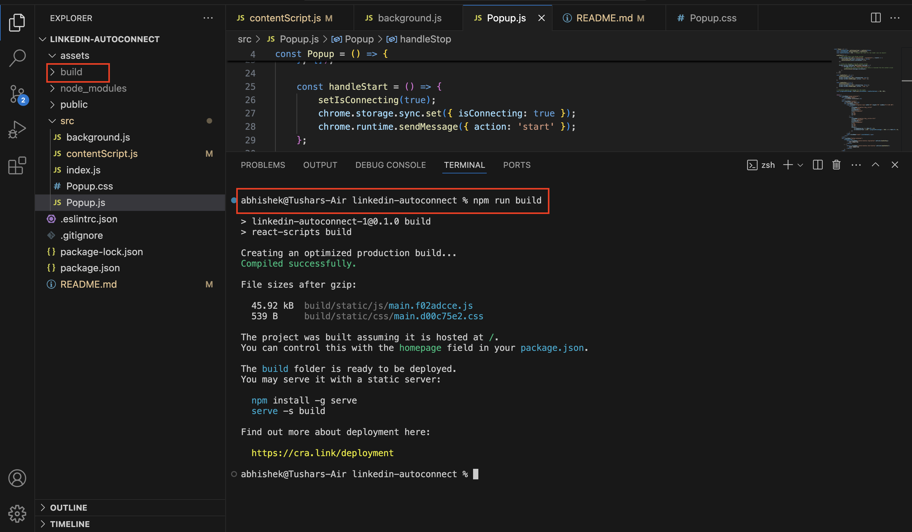
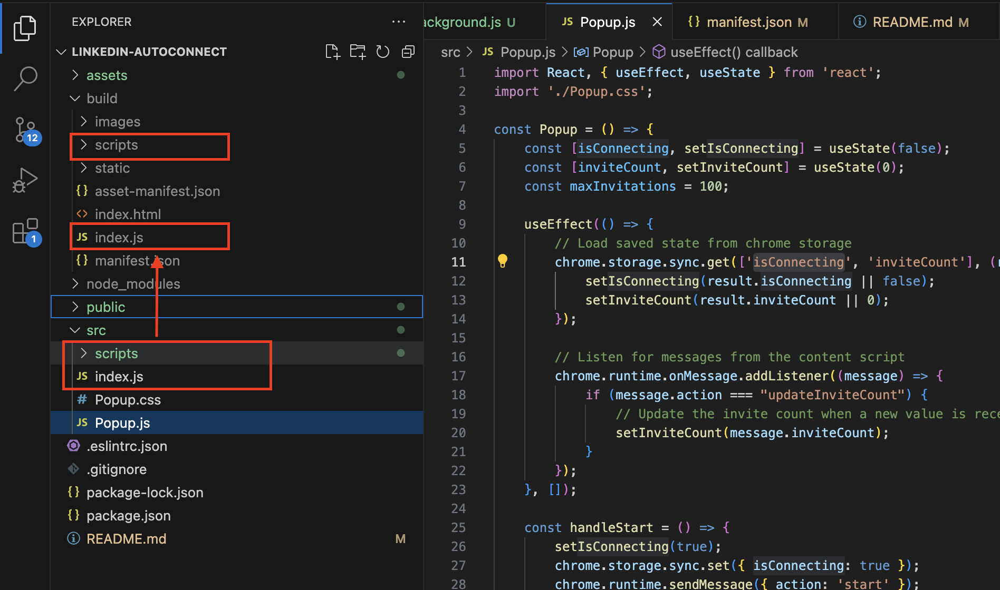
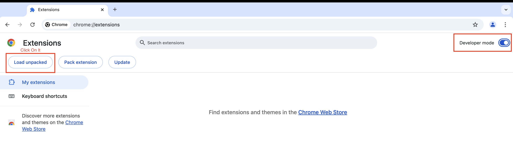
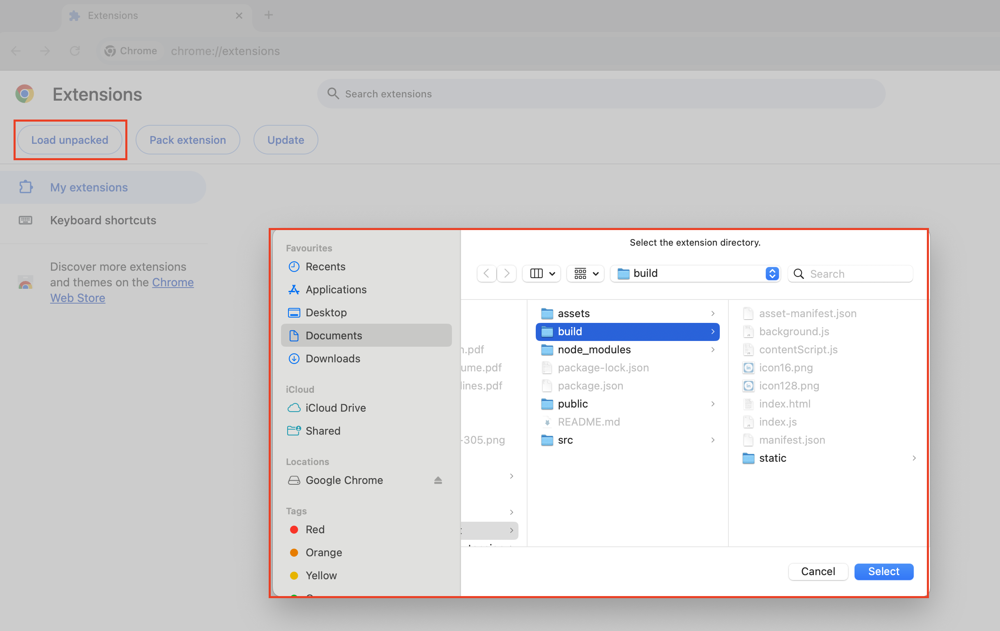
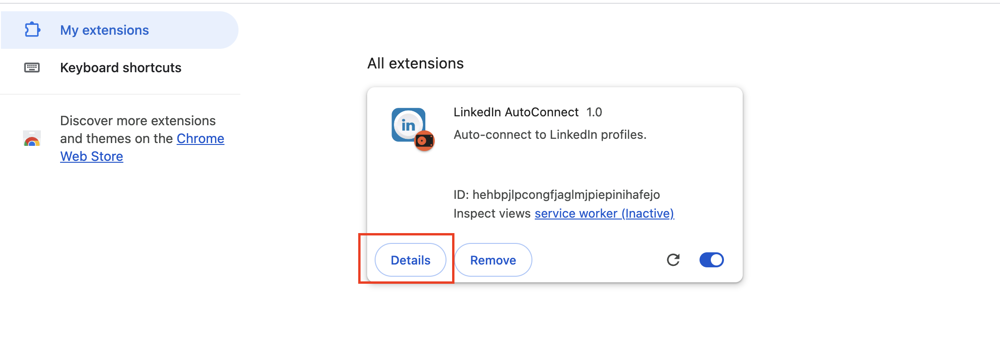
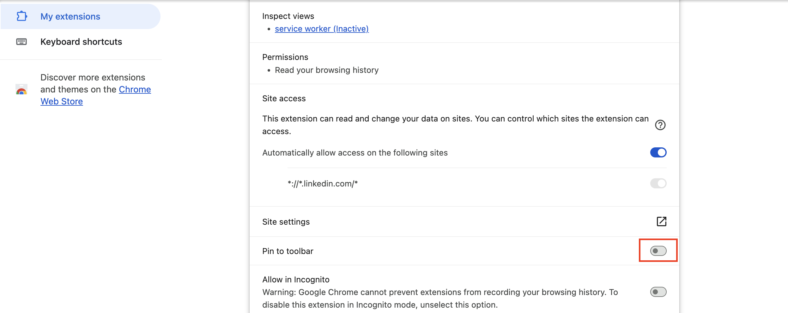
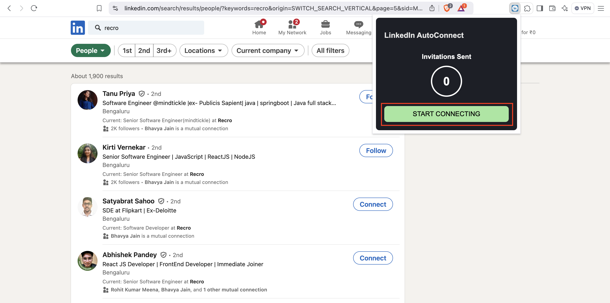

# LinkedIn AutoConnect: Connection Sender

## Overview
This project automates the process of sending connection requests on LinkedIn. It identifies "Connect" buttons on the page, waits for a random delay between 5 to 10 seconds, and then clicks the button to send the connection request without a note. It also keeps track of the number of invites sent using Chrome storage.

## Table of Contents
- [Installation](#installation)
- [Usage](#usage)
- [Architecture](#architecture)

## Installation

### For Direct Download
1. Download Link: https://github.com/abhishekgoyalp/LinkedIn-AutoConnect/releases/latest/download/linkedin-autoconnect-chrome-extension.zip It will download the linkedin-autoconnect-chrome-extension.zip file.
2. Unzip this file. It will contains various files.
   
3. Open Google Chrome, type `chrome://extensions` on your address bar and hit Enter.
4. On the Chrome Extensions page, check the `Developer mode` box. New buttons will be displayed.
5. Click on the button `Load unpacked`.
6. Navigate to the unzipped extension folder, select it and click 'Open'.
7. The extension should now be loaded and enabled on Chrome.
8. Now, it is ready to use.


#### Steps to run the code.
1. **Clone the Repository:**
   ```bash
   git clone https://github.com/abhishekgoyalp/LinkedIn-AutoConnect.git
   cd LinkedIn-AutoConnect
   npm i # For installing the node modules that will help in building the project
   ```
2. **Make Build of this Project**
    - Open the terminal and run `npm run build` command.
   - It will create a build folder which is the installable extension folder.
      
    - Copy the `src/index.js` file and `src/scripts` directory and paste under the build directory.
      
    - Now, it is ready to deploy.

3. **Load the Extension:**
   - Open Chrome and go to `chrome://extensions/`.
   - Enable "Developer mode" at the top right.
      
   - Click "Load unpacked" and select the build directory where extension files are located.
      
   - LinkedIn AutoConnect extension is added in My extension list. Click on the detail button and enable the pin to toolbar option.
      
      

## Usage
Once the extension is pin to toolbar, open the linkedin and search for connections then click on the LinkedIn AutoConnect icon and click on **START CONNECTING** to begin the connecting

It will click on the Connect button. Before clicking it will wait for a random time between 5 and 10 seconds.
Use **STOP CONNECTING** button for stop this process.

## Architecture and Code Discussion

1. **Design Considerations**
The goal of this project is to automate the process of sending connection requests on a social media platform, while also mimicking natural human behavior to avoid detection. A core design principle was ensuring the automation does not appear like a bot, which led to several key decisions in the architecture:

   - **User Simulation:** A random delay between actions helps simulate human-like behavior. Without this, sending requests too quickly could flag the automation as suspicious.
   - **Simplicity & Extensibility:** The code is modular and easy to extend. For example, additional features (such as sending personalized messages with requests) could be added with minimal changes to the core structure.
   - **Chrome Extension Framework:** Using the Chrome extension framework made the most sense for this project because it allows for easy interaction with webpage DOM elements through content scripts. This approach enables the automation to work directly on any loaded webpage without requiring external APIs or more complex browser automation tools.

2. **Chrome Extension Architecture**
The architecture of the Chrome extension follows the standard pattern of extensions but with some specific enhancements for the task at hand:
   - **Content Script:** The core functionality resides in the content script, which directly interacts with the webpage. This script performs several tasks:

      - Scanning the page for "Connect" buttons.
      - Adding delays between connection requests.
      -  Sending messages to the background script for managing persistent data like invite count.
      - The content script is responsible for user interaction, simulating how a human would manually click the "Connect" button.

   - **Background Script:** The background script (not directly shown but implied in the architecture) handles communication with the content script. It listens for commands to start or stop the auto-connect process and also helps manage data like invite count using the Chrome storage API.

   - **Chrome Storage API:** To persist the invite count across sessions, I leveraged Chrome’s storage.sync API. This ensures the data is saved even if the user refreshes the page or closes the browser. This storage solution is lightweight and designed for the simple data we need to persist (i.e., the number of invites sent).

3. **Key Functionality Breakdown**
Here’s a detailed look at how I approached each core function of the project:

   - **Finding Connect Buttons:**
      - I used the querySelectorAll method to find all buttons on the page and then filtered them based on their inner text ("Connect"). This approach was chosen because the "Connect" button on the platform is a standard HTML button element, making it easy to target with this method.
      - The use of forEach allows the script to iterate over all the matching buttons and process each one in sequence.

   - **Randomized Delays:**
      - Mimicking human behavior was crucial, so a random delay between 5 to 10 seconds was added before clicking the "Connect" button. This was achieved by generating a random number within the desired range and using setTimeout to introduce the delay.
      - This randomness reduces the likelihood that the automation will be flagged as a bot. It’s a small but important step toward making the automation more natural.

   - **Tracking Invite Count:**
      - The invite count is updated each time a "Send without a note" button is clicked, and the count is stored in Chrome's storage.sync to persist across page reloads or sessions.
      - This provides the user with feedback on how many invites have been sent, and ensures the data is not lost when the page refreshes.

   - **Message Passing:**
      - Chrome’s messaging API enables communication between the background script and the content script. This is important for controlling when the auto-connect process starts and stops. The decision to use message passing rather than keeping everything in the content script was made to keep the responsibilities clear: content script for UI interactions, background script for state management and command handling.

4. **Challenges and Solutions**
   - **Dealing with Platform Changes:** Since this is a browser automation project, it is dependent on the structure of the target platform. If the platform changes its DOM structure, the selectors (like the "Connect" button) may break. To handle this, I’ve designed the button selection process to be flexible, but regular updates may be necessary if the platform updates.

   - **Avoiding Detection:** Automating interactions with a website can be tricky, especially when the platform has anti-bot measures in place. The random delays, lack of aggressive interactions, and storage of minimal data (only the invite count) help reduce the risk of detection.
